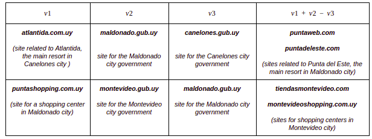

# DNS-VSM
Vector Space Model for DNS (for short, DNS-VSM) is a set of pre-trained vectors (embeddings) for 40000 Internet domain names.

Domain names in the DNS-VSM are represented by vectors where related domain names are mapped to nearby points in the high dimensional space. The DNS-VSM was built only using information of DNS queries from a large uruguayan ISP (with data from 2013) without any other previous knowledge about the content hosted in each domain.

DNS embeddings can be useful in many engineering activities, with practical application in many areas. Some examples include websites recommendations based on similar sites, competitive analysis, identification of fraudulent or risky sites, parental-control systems, UX improvements (based on recommendations, spell correction, etc.), click-stream analysis, representation and clustering of users navigation profiles, optimization of cache systems in recursive DNS resolvers (among others).

